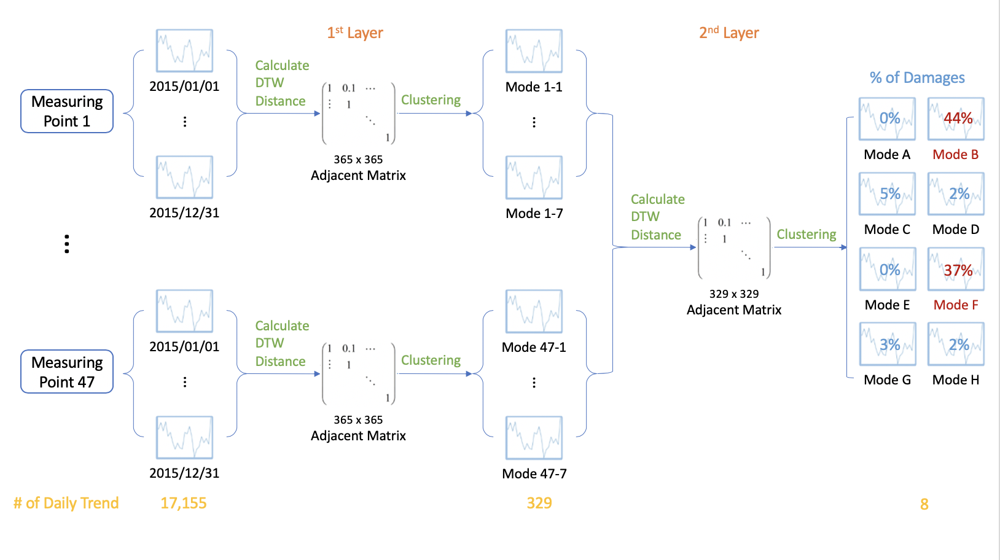

# Pipeline Leakage Diagnosis based on Data Monitoring and Machine Learning

Interdiscipline project in civil engineering & mathematics for undergraduate thesis
Shanghai Institute of Disaster Prevention and Relief & Tongji University

## Introduction

With the lifeline pipeline network continuously extending and playing an increasingly crucial role as the basis for the normal operation of the city, this project builds a leakage detection model based on data analysis of the multi-source monitoring data of the existing lifeline pipeline network system, and then establishes the risk early warning system of the leakage of each pipeline segment, so as to response in time and reduce the impact of lifeline pipe network accidents and encourage the study of prevention mechanisms related to pipe network leakage.

This project first studies the combo pipeline network leakage diagnosis method and time series anomaly detection method, and then proposes a time series anomaly detection algorithm for gas pipeline network leakage diagnosis scenarios. Then, the clustering and anomaly detection models of SCADA measuring points are established. The DTW algorithm is used to measure the similarity of the internal trend of SCADA measuring points. Based on the spectral clustering algorithm, the typical template daily line is obtained. Additionally, the model designed a double-layer clustering method to improve the efficiency. Training was carried out with more than 16,000 time series in 2015, and the validity of the anomaly detection model was proved by the test based on the data of 2016. 

Then, the model above is further optimized considering the geographic distribution of accidents. A double-layer anomaly detection model based on Page Rank algorithm and risk cluster analysis is proposed. The model is tested by the 2015 example, which further improves the flexibility and work efficiency of the leak detection model.

## Leakage Diagnosis Model

## Functions Description
| Function                                                       | Model | File          | Introduction                                                      |
|----------------------------------------------------------------|-------|---------------|-------------------------------------------------------------------|
| create_assist_date(datestart=None, dateend=None)               | 1     | function_1.py | Generate date list                                                |
| get_mid(smp_address)                                           | 1     | function_1.py | Collect unique MID list                                           |
| process_data(date, sample_point)                               | 1     | function_1.py | Generate and plot daily trend of single sample point(hour based)  |
| dtw_distance(ts_a, ts_b, d=lambda x, y: abs(x - y), mww=10000) | 1     | function_1.py | DTW                                                               |
| similarity_matrix_1(d_list, sample_point)                      | 1     | function_1.py | Calculate distance matrix for the first round of clustering       |
| spectral_clustering_1(s_matrix, points, k)                     | 1     | function_1.py | The first round of spectral clustering                            |
| daily_trend_mode_1(k, train, d_list, sample_point)             | 1     | function_1.py | Generate daily trend mode for the clusters(for each sample point) |
| similarity_matrix_2(mode_list)                                 | 1     | function_1.py | Calculate distance matrix for the second round of clustering      |
| spectral_clustering_2(s_matrix, points, k)                     | 1     | function_1.py | The second round of spectral clustering                           |
| daily_trend_mode_2(k, train, mode_list_1)                      | 1     | function_1.py | Generate daily trend mode for the clusters(for all sample points) |
| train(k, date_range, sample_point)                             | 1     | main_1.py     | Train the model to get mode list                                  |
| match(date, sample_point, mode_list)                           | 1     | main_1.py     | Match daily trend with modes                                      |
| detection(date, sample_point, mode_list, risky_mode)           | 1     | main_1.py     | Anomaly Detection                                                 |
| get_location()                                                 | 2     | function_2.py | Get longitude and latitude based on address of accidents          |
| mhd_distance(a, b)                                             | 2     | function_2.py | Calculate manhattan distance                                      |
| graphmove(a)                                                   | 2     | function_2.py | Calculate move matrix for page rank                               |
| firstpr(c)                                                     | 2     | function_2.py | Set initial pr                                                    |
| cal_pr(p, m, v)                                                | 2     | function_2.py | Calculate pr                                                      |
| pagerank(data)                                                 | 2     | function_2.py | Excute Page Rank algorithm                                        |
| train_rp(k, represent_points, acc_data)                        | 2     | function_2.py | Train the model to get mode list for represent points             |
| train_cluster(k, represent_sp_mid, sp_cluster, acc_data)       | 2     | function_2.py | Train the model to get mode list for each cluster                 |
